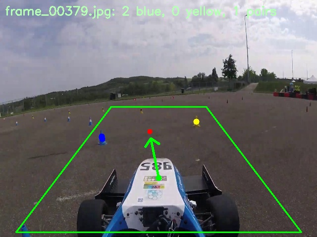

# FSD-Navigation

Autonomous navigation pipeline for Formula Student Driverless (FSD) vehicles using computer vision, object detection, and real-time trajectory planning. This repository implements a cone detection-based system that detects track boundaries, localizes the vehicle path, and visualizes the intended trajectory using real-time YOLO-based inference.

### 1. Cone Detection 
<div align="center">
  
</div>

### 2. Trajectory planning
<div align="center">
  
</div>
---

## 📁 Project Structure

```
FSD-Navigation/
│
├── data/                     # Dataset directory to add FSOCO
│
├── models/
│   └── yolov5/               # Trained YOLOv5 weights (best.pt, best.onnx)
│
├── results/
│   ├── eda/                  # Plots from EDA
│   └── planning/             # Visualizations of trajectory outputs
├── src/
│   ├── eda/                  # Exploratory Data Analysis
│   ├── perception/           # YOLOv5 training and inference scripts
│   └── planning/             # Midpoint computation and trajectory generation
│
├── .gitignore
├── requirements.txt
└── README.md
```

---

## 1. Dataset

We use the [FSOCO Dataset](https://fsoco.dev/) — a collaborative dataset built for training cone detection models in Formula Student Driverless competitions. The dataset contains labeled bounding boxes for:

- **Left (Blue) cones** – Class `0`
- **Right (Yellow) cones** – Class `4`
- **Optional center/orange cones** – Not used in this project

> Dataset not included in the repository due to size. You can place your dataset in `data/` and update paths accordingly.

---

## 2. Objective

The goal of this project is to:

- Train a real-time object detector to recognize cones
- Extract cone midpoints from left-right pairs
- Compute a feasible trajectory by fitting a curve through the midpoints
- Overlay the trajectory on the input frame using a fixed car-top reference point

---

## 3. Workflow Overview

| Stage        | Description                                                                 |
|--------------|-----------------------------------------------------------------------------|
| Data Prep    | Preprocessing and label formatting for YOLOv5                              |
| EDA          | Analyze class balance, image dimensions, and label integrity               |
| Training     | YOLOv5 model trained on labeled images using Ultralytics framework         |
| Inference    | Perform detection on test images or videos to get cone coordinates         |
| Planning     | Compute midpoints from cone pairs and fit a quadratic trajectory           |
| Visualization| Overlay trajectory and arrows on original image or video frames            |

---

## 4. Training

Model is trained using [Ultralytics YOLOv5](https://github.com/ultralytics/yolov5):

```bash
python src/perception/train_model.py
```

Model weights are saved in:

```
models/yolov5/
├── best.pt
├── best.onnx
└── last.pt
```

---

## 5. Real-Time Inference and Planning

This is the main runtime script for real-time trajectory generation:

```bash
python src/planning/real-time_trajectory_planner.py
```

- Uses `best.onnx` or `best.pt` for inference
- Filters cones inside an ROI
- Pairs left-right cones to calculate midpoints
- Fits a quadratic curve through 3+ midpoints
- Draws arrows from car-top to first midpoint, then to the next

---

## 6. Key Visualizations

- `results/eda/` — Label stats, class distribution, scatter plots
- `results/planning/trajectory_arrows.jpg` — Arrows from car point to midpoint
- `results/planning/trajectory_animation.gif` — End-to-end cone detection with trajectory overlay (demo output)

---

## 7. Requirements

Install dependencies:

```bash
pip install -r requirements.txt
```

Note:
- For ONNXRuntime, ensure you have compatible CUDA DLLs or switch to CPU.
- Run YOLO with either `.pt` or `.onnx` depending on your runtime.

---

## 8. Future Scope

- Integrate stereo depth or LiDAR for 3D localization
- Fuse GPS/IMU data for SLAM-based path planning
- Extend to full stack autonomous driving simulator (CARLA or custom track)

---

## 9. Credits

Developed by [Akshay Chobe](https://github.com/akshaychobe) for academic and competitive use in Formula Student Driverless competitions.  
Dataset by FSOCO contributors.  
Object detection using Ultralytics YOLOv5.
